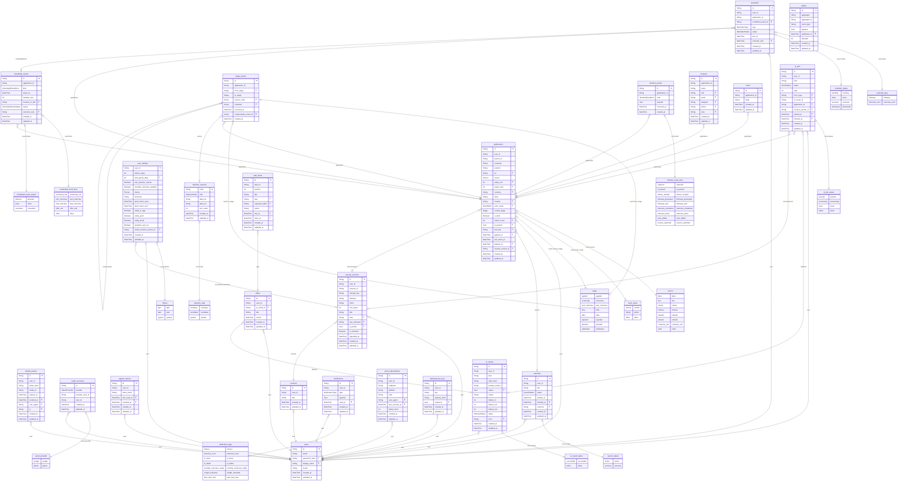

```mermaid
erDiagram

        theme {
            light light
dark dark
system system
        }
    


        oauth_provider {
            google google
github github
        }
    


        stage {
            applied applied
screening screening
tech_interview tech_interview
final final
offer offer
rejected rejected
ghosted ghosted
withdrawn withdrawn
        }
    


        source {
            djinni djinni
dou dou
robota robota
workua workua
linkedin linkedin
referral referral
company_site company_site
other other
        }
    


        work_mode {
            remote remote
hybrid hybrid
office office
        }
    


        rejection_side {
            company company
candidate candidate
system system
        }
    


        search_status {
            active active
archived archived
        }
    


        scheduled_event_kind {
            screening_call screening_call
tech_interview tech_interview
final_interview final_interview
offer_call offer_call
other other
        }
    


        scheduled_event_status {
            planned planned
done done
cancelled cancelled
        }
    


        timeline_event_kind {
            captured captured
ai_parsed ai_parsed
silence_started silence_started
followup_generated followup_generated
followup_sent followup_sent
interview_scheduled interview_scheduled
interview_done interview_done
note_added note_added
resume_attached resume_attached
        }
    


        reminder_type {
            followup followup
interview_soon interview_soon
        }
    


        reminder_status {
            pending pending
done done
snoozed snoozed
dismissed dismissed
        }
    


        notification_type {
            silence silence
interview_soon interview_soon
ai_done ai_done
ai_failed ai_failed
monthly_summary_ready monthly_summary_ready
insight_unlocked insight_unlocked
plan_item_due plan_item_due
        }
    


        ai_job_status {
            queued queued
processing processing
done done
failed failed
        }
    


        ai_result_status {
            succeeded succeeded
failed failed
        }
    
  "users" {
    String id "🗝️"
    String email 
    String password_hash "❓"
    String display_name "❓"
    String locale 
    DateTime created_at 
    DateTime updated_at 
    }
  

  "user_settings" {
    String user_id "🗝️"
    Int silence_days 
    Int auto_ghost_days "❓"
    Boolean ask_rejection_reason 
    Boolean monthly_summary_enabled 
    Theme theme 
    String timezone 
    DateTime quiet_hours_start 
    DateTime quiet_hours_end 
    Boolean notify_in_app 
    Boolean notify_push 
    Boolean notify_email 
    Boolean analytics_opt_out 
    String active_resume_version_id "❓"
    DateTime created_at 
    DateTime updated_at 
    }
  

  "refresh_tokens" {
    String id "🗝️"
    String user_id 
    String token_hash 
    String family_id 
    DateTime expires_at 
    DateTime revoked_at "❓"
    String user_agent "❓"
    String ip "❓"
    DateTime created_at 
    DateTime updated_at 
    }
  

  "oauth_accounts" {
    String id "🗝️"
    OAuthProvider provider 
    String provider_user_id 
    String user_id 
    DateTime created_at 
    DateTime updated_at 
    }
  

  "capture_tokens" {
    String id "🗝️"
    String user_id 
    String token_hash 
    DateTime last_used_at "❓"
    DateTime revoked_at "❓"
    DateTime created_at 
    DateTime updated_at 
    }
  

  "searches" {
    String id "🗝️"
    String user_id 
    String title 
    SearchStatus status 
    DateTime started_at 
    DateTime finished_at "❓"
    String outcome "❓"
    DateTime created_at 
    DateTime updated_at 
    }
  

  "applications" {
    String id "🗝️"
    String user_id 
    String search_id 
    String company 
    String position 
    String url "❓"
    Source source 
    Int salary_min "❓"
    Int salary_max "❓"
    String currency "❓"
    String stack 
    String location "❓"
    WorkMode work_mode "❓"
    Stage current_stage 
    Boolean is_draft 
    Int match_score "❓"
    Json ai_parsed "❓"
    String raw_text "❓"
    DateTime applied_at "❓"
    DateTime last_event_at 
    DateTime deleted_at "❓"
    String resume_version_id "❓"
    DateTime created_at 
    DateTime updated_at 
    }
  

  "stage_events" {
    String id "🗝️"
    String application_id 
    Stage from_stage "❓"
    Stage to_stage 
    String reason_code "❓"
    String comment "❓"
    DateTime occurred_at 
    String compensates_event_id "❓"
    DateTime created_at 
    }
  

  "timeline_events" {
    String id "🗝️"
    String application_id 
    TimelineEventKind kind 
    Json payload 
    DateTime occurred_at 
    DateTime created_at 
    }
  

  "rejection_reasons" {
    String code "🗝️"
    RejectionSide side 
    String label_uk 
    String label_en 
    Int sort_order 
    DateTime created_at 
    DateTime updated_at 
    }
  

  "contacts" {
    String id "🗝️"
    String application_id 
    String name 
    String role "❓"
    String email "❓"
    String telegram "❓"
    String phone "❓"
    String note "❓"
    DateTime created_at 
    DateTime updated_at 
    }
  

  "notes" {
    String id "🗝️"
    String application_id 
    String body 
    DateTime created_at 
    DateTime updated_at 
    }
  

  "scheduled_events" {
    String id "🗝️"
    String application_id 
    ScheduledEventKind kind 
    DateTime starts_at 
    Int duration_min 
    String location_or_link "❓"
    ScheduledEventStatus status 
    String outcome_note "❓"
    DateTime created_at 
    DateTime updated_at 
    }
  

  "resumes" {
    String id "🗝️"
    String user_id 
    String title 
    DateTime created_at 
    DateTime updated_at 
    }
  

  "resume_versions" {
    String id "🗝️"
    String user_id 
    String resume_id 
    String storage_key 
    String filename 
    String mime 
    Int size_bytes 
    String title 
    String note "❓"
    String text_extracted "❓"
    Json ai_profile "❓"
    Boolean is_archived 
    DateTime uploaded_at 
    DateTime created_at 
    DateTime updated_at 
    }
  

  "ai_results" {
    String id "🗝️"
    String user_id 
    String kind 
    String input_hash 
    String prompt_version 
    Json output "❓"
    String model 
    Int tokens_in 
    Int tokens_out 
    Int latency_ms 
    AiResultStatus status 
    String error "❓"
    DateTime created_at 
    DateTime updated_at 
    }
  

  "ai_jobs" {
    String id "🗝️"
    String user_id 
    String kind 
    AiJobStatus status 
    Int step 
    String error_type "❓"
    String ai_result_id "❓"
    String application_id "❓"
    String resume_version_id "❓"
    DateTime started_at "❓"
    DateTime finished_at "❓"
    DateTime created_at 
    DateTime updated_at 
    }
  

  "reminders" {
    String id "🗝️"
    String user_id 
    String application_id 
    String scheduled_event_id "❓"
    ReminderType type 
    ReminderStatus status 
    DateTime due_at 
    DateTime snoozed_until "❓"
    DateTime created_at 
    DateTime updated_at 
    }
  

  "notifications" {
    String id "🗝️"
    String user_id 
    NotificationType type 
    Json payload 
    DateTime read_at "❓"
    DateTime created_at 
    DateTime updated_at 
    }
  

  "push_subscriptions" {
    String id "🗝️"
    String user_id 
    String endpoint 
    String p256dh 
    String auth 
    String user_agent "❓"
    DateTime last_success_at "❓"
    Int failed_count 
    DateTime created_at 
    DateTime updated_at 
    }
  

  "outbox" {
    String id "🗝️"
    String aggregate 
    String aggregate_id 
    String event_type 
    Json payload 
    DateTime published_at "❓"
    Int attempts 
    DateTime created_at 
    DateTime updated_at 
    }
  

  "idempotency_keys" {
    String id "🗝️"
    String user_id 
    String key 
    String request_hash 
    Json response "❓"
    DateTime created_at 
    DateTime updated_at 
    }
  

  "plans" {
    String id "🗝️"
    String user_id 
    String ai_result_id "❓"
    String title 
    DateTime month 
    DateTime created_at 
    DateTime updated_at 
    }
  

  "plan_items" {
    String id "🗝️"
    String plan_id 
    Int position 
    String title 
    String why "❓"
    String expected_effect "❓"
    String metric "❓"
    DateTime due_at "❓"
    DateTime done_at "❓"
    DateTime created_at 
    DateTime updated_at 
    }
  
    "user_settings" |o--|| "theme" : "enum:theme"
    "user_settings" |o--|| "users" : "user"
    "user_settings" }o--|o "resume_versions" : "activeResumeVersion"
    "refresh_tokens" }o--|| "users" : "user"
    "oauth_accounts" |o--|| "oauth_provider" : "enum:provider"
    "oauth_accounts" }o--|| "users" : "user"
    "capture_tokens" }o--|| "users" : "user"
    "searches" |o--|| "search_status" : "enum:status"
    "searches" }o--|| "users" : "user"
    "applications" |o--|| "source" : "enum:source"
    "applications" |o--|o "work_mode" : "enum:work_mode"
    "applications" |o--|| "stage" : "enum:current_stage"
    "applications" }o--|| "users" : "user"
    "applications" }o--|| "searches" : "search"
    "applications" }o--|o "resume_versions" : "resumeVersion"
    "stage_events" |o--|o "stage" : "enum:from_stage"
    "stage_events" |o--|| "stage" : "enum:to_stage"
    "stage_events" }o--|| "applications" : "application"
    "stage_events" }o--|o "rejection_reasons" : "reason"
    "stage_events" |o--|o "stage_events" : "compensates"
    "timeline_events" |o--|| "timeline_event_kind" : "enum:kind"
    "timeline_events" }o--|| "applications" : "application"
    "rejection_reasons" |o--|| "rejection_side" : "enum:side"
    "contacts" }o--|| "applications" : "application"
    "notes" }o--|| "applications" : "application"
    "scheduled_events" |o--|| "scheduled_event_kind" : "enum:kind"
    "scheduled_events" |o--|| "scheduled_event_status" : "enum:status"
    "scheduled_events" }o--|| "applications" : "application"
    "resumes" }o--|| "users" : "user"
    "resume_versions" }o--|| "users" : "user"
    "resume_versions" }o--|| "resumes" : "resume"
    "ai_results" |o--|| "ai_result_status" : "enum:status"
    "ai_results" }o--|| "users" : "user"
    "ai_jobs" |o--|| "ai_job_status" : "enum:status"
    "ai_jobs" }o--|| "users" : "user"
    "ai_jobs" }o--|o "ai_results" : "aiResult"
    "ai_jobs" }o--|o "applications" : "application"
    "ai_jobs" }o--|o "resume_versions" : "resumeVersion"
    "reminders" |o--|| "reminder_type" : "enum:type"
    "reminders" |o--|| "reminder_status" : "enum:status"
    "reminders" }o--|| "users" : "user"
    "reminders" }o--|| "applications" : "application"
    "reminders" }o--|o "scheduled_events" : "scheduledEvent"
    "notifications" |o--|| "notification_type" : "enum:type"
    "notifications" }o--|| "users" : "user"
    "push_subscriptions" }o--|| "users" : "user"
    "idempotency_keys" }o--|| "users" : "user"
    "plans" }o--|| "users" : "user"
    "plans" }o--|o "ai_results" : "aiResult"
    "plan_items" }o--|| "plans" : "plan"
```
